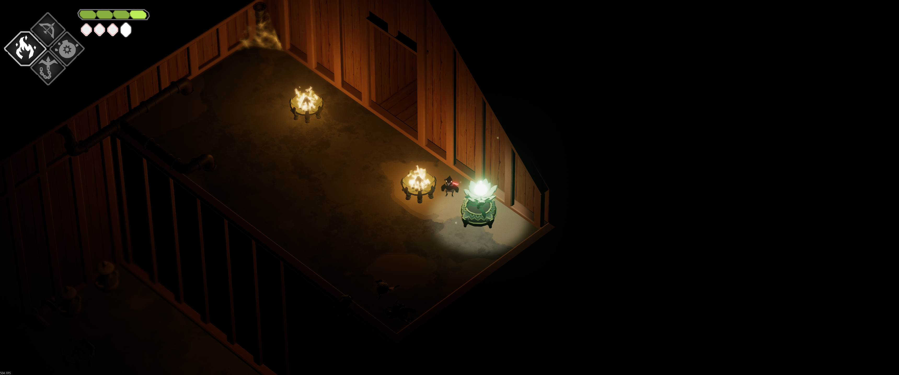

- [Seeds](#seeds)
	- [Cemetery seed 1](#cemetery-seed-1)
	- [Cemetery seed 2](#cemetery-seed-2)
	- [Cemetery seed 3](#cemetery-seed-3)
	- [Cemetery seed 4](#cemetery-seed-4)
	- [Estate seed 1](#estate-seed-1)
	- [Estate seed 2](#estate-seed-2)
	- [Estate seed 3](#estate-seed-3)
	- [Estate seed 4](#estate-seed-4)
	- [Manor seed 1](#manor-seed-1)
	- [Manor seed 2](#manor-seed-2)
	- [Manor seed 3](#manor-seed-3)
	- [Manor seed 4](#manor-seed-4)
	- [Manor seed 5](#manor-seed-5)
	- [Manor seed 6](#manor-seed-6)
	- [Manor seed 7](#manor-seed-7)
	- [Observation seed 1](#observation-seed-1)
	- [Observation seed 2](#observation-seed-2)
	- [Inner Furnace seed 1](#inner-furnace-seed-1)
	- [Inner Furnace seed 2](#inner-furnace-seed-2)
	- [Inner Furnace seed 3](#inner-furnace-seed-3)
	- [Ruins seed 1](#ruins-seed-1)
	- [Ruins seed 2](#ruins-seed-2)
	- [Ruins seed 3](#ruins-seed-3)
	- [Ruins seed 4](#ruins-seed-4)
	- [Ruins seed 5](#ruins-seed-5)
	- [Ruins seed 6](#ruins-seed-6)
	- [Dungeon seed 1](#dungeon-seed-1)
	- [Dungeon seed 2](#dungeon-seed-2)
	- [Dungeon seed 3](#dungeon-seed-3)
	- [Dungeon seed 4](#dungeon-seed-4)
	- [Dungeon seed 5](#dungeon-seed-5)
	- [Stranded Sailor Transition seed](#stranded-sailor-transition-seed)
	- [Stranded Sailor seed](#stranded-sailor-seed)
	- [Lockstone seed 1](#lockstone-seed-1)
	- [Lockstone seed 2](#lockstone-seed-2)
	- [Lockstone seed 3](#lockstone-seed-3)
	- [Lockstone seed 4](#lockstone-seed-4)
	- [Lockstone seed 5](#lockstone-seed-5)
	- [Post Lockstone seed 1](#post-lockstone-seed-1)
	- [Post Lockstone seed 2](#post-lockstone-seed-2)
	- [Camp seed](#camp-seed)
	- [Watchtowers seed 1](#watchtowers-seed-1)
	- [Watchtowers seed 2](#watchtowers-seed-2)
	- [Watchtowers seed 3](#watchtowers-seed-3)
	- [Watchtowers seed 4](#watchtowers-seed-4)
	- [Flooded Fortress seed 1](#flooded-fortress-seed-1)
	- [Flooded Fortress seed 2](#flooded-fortress-seed-2)
	- [Flooded Fortress seed 3](#flooded-fortress-seed-3)
	- [Flooded Fortress seed 4](#flooded-fortress-seed-4)
	- [Flooded Fortress seed 5](#flooded-fortress-seed-5)
- [Pots](#pots)
	- [Cemetery pot 1](#cemetery-pot-1)
	- [Cemetery pot 2](#cemetery-pot-2)
	- [Cemetery pot 3](#cemetery-pot-3)
	- [Cemetery pot 4](#cemetery-pot-4)
	- [Cemetery pot 5](#cemetery-pot-5)
	- [Spider Den pot](#spider-den-pot)
	- [Crypt pot](#crypt-pot)
	- [Estate pot 1](#estate-pot-1)
	- [Estate pot 2](#estate-pot-2)
	- [Estate pot 3](#estate-pot-3)
	- [Estate pot 4](#estate-pot-4)
	- [Estate pot 5](#estate-pot-5)
	- [Estate pot 6](#estate-pot-6)
	- [Estate pot 7](#estate-pot-7)
	- [Manor pot 1](#manor-pot-1)
	- [Manor pot 2](#manor-pot-2)
	- [Manor pot 3](#manor-pot-3)
	- [Manor pot 4](#manor-pot-4)
	- [Manor pot 5](#manor-pot-5)
	- [Manor pot 6](#manor-pot-6)
	- [Inner Furnace pot 1](#inner-furnace-pot-1)
	- [Inner Furnace pot 2](#inner-furnace-pot-2)
	- [Inner Furnace pot 3](#inner-furnace-pot-3)
	- [Inner Furnace pot 4](#inner-furnace-pot-4)
	- [Inner Furnace pot 5](#inner-furnace-pot-5)
	- [Ruins pot 1](#ruins-pot-1)
	- [Ruins pot 2](#ruins-pot-2)
	- [Ruins pot 3](#ruins-pot-3)
	- [Ruins pot 4](#ruins-pot-4)
	- [Ruins pot 5](#ruins-pot-5)
	- [Dungeon pot 1](#dungeon-pot-1)
	- [Dungeon pot 2](#dungeon-pot-2)
	- [Dungeon pot 3](#dungeon-pot-3)
	- [Dungeon pot 4](#dungeon-pot-4)
	- [Stranded Sailor Transition plant](#stranded-sailor-transition-plant)
	- [Lockstone plant 1](#lockstone-plant-1)
	- [Lockstone plant 2](#lockstone-plant-2)
	- [Lockstone plant 3](#lockstone-plant-3)
	- [Lockstone plant 4](#lockstone-plant-4)
	- [Post Lockstone plant](#post-lockstone-plant)
	- [Watchtowers plant 1](#watchtowers-plant-1)
	- [Watchtowers plant 2](#watchtowers-plant-2)
	- [Watchtowers plant 3](#watchtowers-plant-3)
	- [Watchtowers plant 4](#watchtowers-plant-4)
	- [Watchtowers plant 5](#watchtowers-plant-5)
	- [Flooded Fortress plant 1](#flooded-fortress-plant-1)
	- [Flooded Fortress plant 2](#flooded-fortress-plant-2)
	- [Flooded Fortress plant 3](#flooded-fortress-plant-3)
	- [Flooded Fortress plant 4](#flooded-fortress-plant-4)
	- [Flooded Fortress plant 5](#flooded-fortress-plant-5)

---
### Seeds
#### Cemetery seed 1

#### Cemetery seed 2

#### Cemetery seed 3

#### Cemetery seed 4

#### Estate seed 1

#### Estate seed 2

#### Estate seed 3

#### Estate seed 4

#### Manor seed 1

#### Manor seed 2

#### Manor seed 3

#### Manor seed 4

#### Manor seed 5

#### Manor seed 6

#### Manor seed 7

#### Observation seed 1

#### Observation seed 2

#### Inner Furnace seed 1

#### Inner Furnace seed 2

#### Inner Furnace seed 3

#### Ruins seed 1

#### Ruins seed 2

#### Ruins seed 3

#### Ruins seed 4

#### Ruins seed 5

#### Ruins seed 6

#### Dungeon seed 1

#### Dungeon seed 2

#### Dungeon seed 3

#### Dungeon seed 4

#### Dungeon seed 5

#### Stranded Sailor Transition seed

#### Stranded Sailor seed

#### Lockstone seed 1

#### Lockstone seed 2

#### Lockstone seed 3

#### Lockstone seed 4

#### Lockstone seed 5

#### Post Lockstone seed 1

#### Post Lockstone seed 2

#### Camp seed

#### Watchtowers seed 1

#### Watchtowers seed 2

#### Watchtowers seed 3

#### Watchtowers seed 4

#### Flooded Fortress seed 1

#### Flooded Fortress seed 2

#### Flooded Fortress seed 3

#### Flooded Fortress seed 4

#### Flooded Fortress seed 5

---
### Pots
#### Cemetery pot 1

#### Cemetery pot 2

#### Cemetery pot 3

#### Cemetery pot 4

#### Cemetery pot 5

#### Spider Den pot

#### Crypt pot

#### Estate pot 1

#### Estate pot 2

#### Estate pot 3

#### Estate pot 4

#### Estate pot 5

#### Estate pot 6

#### Estate pot 7

#### Manor pot 1

#### Manor pot 2

#### Manor pot 3

#### Manor pot 4

#### Manor pot 5

#### Manor pot 6

#### Inner Furnace pot 1

#### Inner Furnace pot 2

#### Inner Furnace pot 3

#### Inner Furnace pot 4

#### Inner Furnace pot 5

#### Ruins pot 1

#### Ruins pot 2

#### Ruins pot 3

#### Ruins pot 4

#### Ruins pot 5

#### Dungeon pot 1

#### Dungeon pot 2

#### Dungeon pot 3

#### Dungeon pot 4

#### Stranded Sailor Transition plant

#### Lockstone plant 1

#### Lockstone plant 2

#### Lockstone plant 3

#### Lockstone plant 4

#### Post Lockstone plant

#### Watchtowers plant 1

#### Watchtowers plant 2

#### Watchtowers plant 3

#### Watchtowers plant 4

#### Watchtowers plant 5

#### Flooded Fortress plant 1

#### Flooded Fortress plant 2

#### Flooded Fortress plant 3

#### Flooded Fortress plant 4

#### Flooded Fortress plant 5
